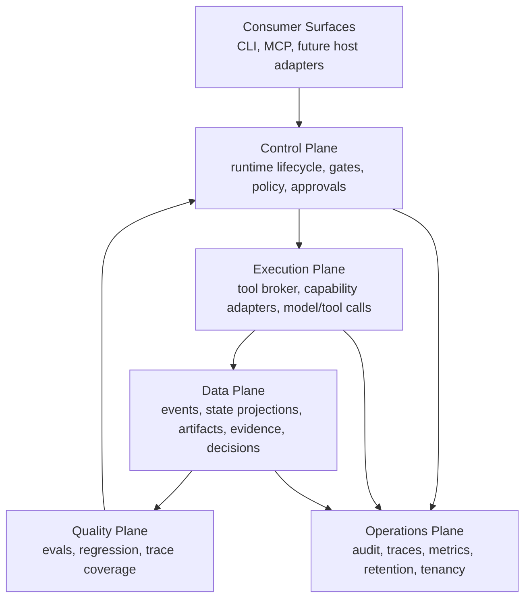
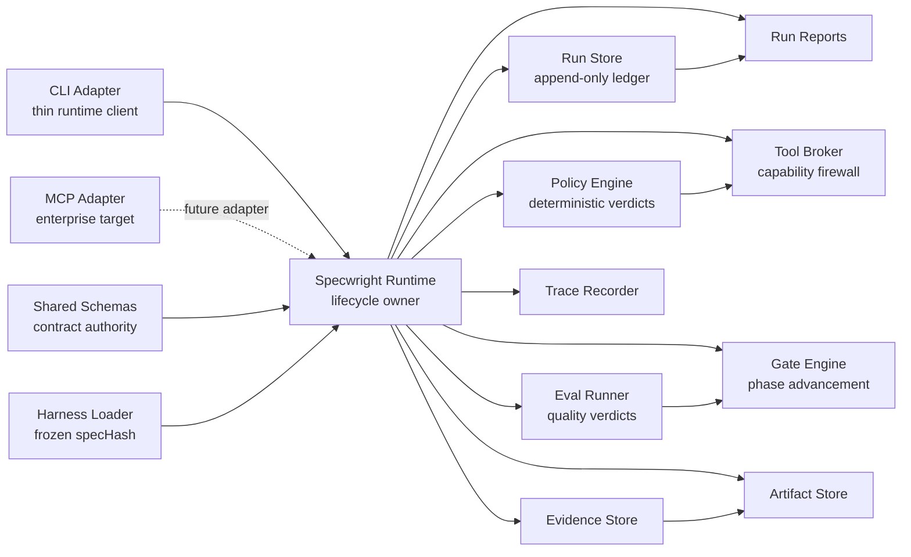
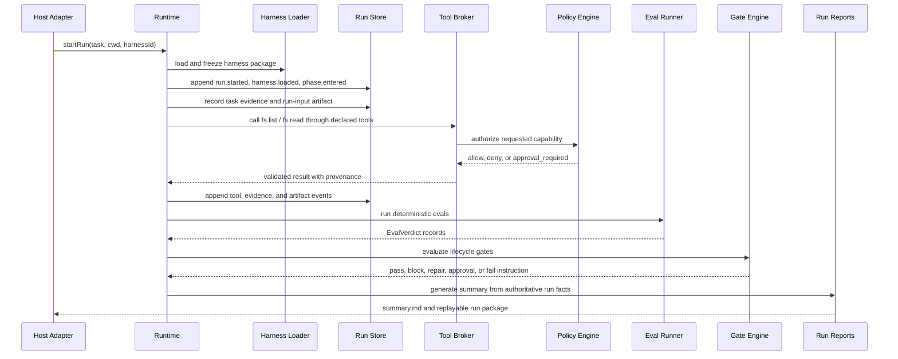

# Specwright

<p align="center">
  
</p>

**Specwright is a strict, replayable agent harness runtime for governed, source-grounded work.**

It is built for teams that need agentic workflows to behave like production systems: lifecycle-bound, policy-governed, capability-brokered, evidence-grounded, artifact-validated, eval-checked, replayable, auditable, and portable across host surfaces.

Specwright is not a chatbot, a prompt pack, or a pile of agent tools. It is the runtime law around agent work: host adapters submit intent, the runtime owns behavior, external capability flows through a broker, gates decide lifecycle advancement, policy stays deterministic, and the append-only run log remains the source of truth.

## Why Specwright Exists

Modern coding agents can produce impressive work, but most harnesses still leave critical production questions to convention:

- What exactly did the agent do, in what order, and under which authority?
- Which facts came from source evidence, which were assumptions, and which remain unknown?
- Which tool calls were allowed, denied, approved, cached, redacted, or replayed?
- Why did a lifecycle phase advance?
- Can the run be reconstructed later without trusting a transcript?

Specwright answers those questions with runtime-owned contracts instead of vibes.

## What This Repository Contains

This repository is the TypeScript/Bun implementation of the Specwright runtime platform. It proves the strict runtime path with a default source-bound harness, a reference CLI adapter, governed eval execution, deterministic packages, and replayable run packages.

| Package | Responsibility |
| --- | --- |
| `@specwright/schemas` | Zod contracts, generated types, event and artifact/evidence authority. |
| `@specwright/run-store` | File-first append-only run ledger, state projection, replay, retention, sealing, archival, and migration fixtures. |
| `@specwright/harness-loader` | Declarative harness loading, validation, compatibility, trust, and immutable `specHash` snapshots. |
| `@specwright/policy-engine` | Deterministic `allow`, `deny`, and `approval_required` verdicts with replayable decision hashes. |
| `@specwright/gate-engine` | Lifecycle gate evaluation and phase-advancement instructions. |
| `@specwright/tool-broker` | Sole external-capability boundary for tools, validation, policy, approval coordination, redaction, provenance, and replay. |
| `@specwright/eval-runner` | Governed eval execution with registry resolution, deterministic verdict hashes, constrained model-assisted grading, pinned datasets, regression checks, event/span emission, and conformance fixtures. |
| `@specwright/evidence-store` | Evidence records for source facts, assumptions, human decisions, and unresolved unknowns. |
| `@specwright/artifact-store` | Schema-valid artifact recording bound to evidence. |
| `@specwright/trace-recorder` | Runtime-observable trace spans for phases, tools, gates, evals, approvals, and cache. |
| `@specwright/run-reports` | Human-readable run reports generated from authoritative run facts. |
| `@specwright/runtime` | Orchestration facade that wires the stores, loader, policy, gates, broker, evals, traces, artifacts, and reports. |
| `@specwright/adapters-cli` | Reference CLI adapter. It calls the runtime and renders responses; it does not own lifecycle behavior. |
| `harnesses/default` | Default Harness v0: phases, gates, policies, tools, artifact schemas, and eval definitions. |

## Architecture

### Product Planes



### Runtime Dependency Shape



### Run Lifecycle



## Current Proof Path

The default proof run demonstrates the strict path end to end:

1. Start a run with the default declarative harness.
2. Record the user task as evidence and the run input as a schema-valid artifact.
3. Read source files only through `ToolBroker` capabilities.
4. Record source-bound evidence and artifacts.
5. Evaluate lifecycle gates for intake, evidence, planning, verification, and packaging.
6. Run governed evals for artifact schema presence, completeness, source fidelity, and conformance boundaries.
7. Write `summary.md`.
8. Replay the run from `events.jsonl` and verify the projection.

Current boundaries are intentional. Broad model generation, shell execution, git mutation, browser automation, external MCP calls, and production MCP surfaces only belong behind the same policy, broker, gate, trace, eval, provenance, and replay boundaries before they become runtime power.

## Install

Specwright uses Bun workspaces.

```bash
git clone <repo-url>
cd <repo-directory>
bun install
```

Build all packages in dependency order:

```bash
bun run build
```

Run the test suite:

```bash
bun test
```

Run TypeScript checks:

```bash
bun run typecheck
```

Run the v0 proof:

```bash
bun run proof:v0
```

## Eval Runner

`packages/eval-runner` owns the Scope 07 eval contract. It resolves governed eval definitions from registry manifests, produces schema-valid verdicts with deterministic decision hashes, fails closed for malformed or unsupported inputs, routes model-assisted grading through explicit broker ports, binds regression checks to pinned dataset content, and records eval verdict/repair provenance as runtime events and trace spans.

Run the eval-runner conformance suite directly:

```bash
bun run --cwd packages/eval-runner test
bun run --cwd packages/eval-runner typecheck
```

The CI conformance gate runs when `packages/eval-runner/**` or its workflow changes, and includes install, build, eval-runner tests, eval-runner typecheck, root typecheck, and `proof:v0`.

## Use The Reference CLI

After building, run the local CLI entry point directly:

```bash
bun packages/adapters-cli/dist/bin.js help
```

Start a source-bound run against the included fixture:

```bash
bun packages/adapters-cli/dist/bin.js run \
  --cwd fixtures/simple-app \
  --task "Create a source-bound frontend contract" \
  --json
```

The command returns a `runId` and writes a run package under the target workspace. Use that `runId` to inspect, replay, and report:

```bash
bun packages/adapters-cli/dist/bin.js status <run-id> --root fixtures/simple-app
bun packages/adapters-cli/dist/bin.js events <run-id> --root fixtures/simple-app
bun packages/adapters-cli/dist/bin.js replay <run-id> --root fixtures/simple-app
bun packages/adapters-cli/dist/bin.js report <run-id> --root fixtures/simple-app
```

The intended installed command name is `specwright`; the direct `bun packages/adapters-cli/dist/bin.js` form is the simplest local workspace path today.

## Use The Runtime API

The runtime facade is the integration surface for adapters and automation:

```ts
import { createRuntime } from "@specwright/runtime";

const runtime = createRuntime();

const handle = await runtime.startRun({
  task: "Create a source-bound frontend contract",
  cwd: "fixtures/simple-app",
  harnessId: "default",
  host: {
    kind: "cli"
  }
});

await runtime.callTool(handle.runId, {
  toolId: "fs.list",
  input: {
    path: "src"
  }
});

await runtime.runEval(handle.runId, "source_fidelity");
await runtime.evaluateGate(handle.runId, "verification.required_evals");
await runtime.writeRunReport(handle.runId);
```

## What Specwright Should Be Used For

Specwright is designed for teams building agent workflows where correctness, auditability, source grounding, and capability governance matter as much as task completion.

Good fits:

- enterprise coding-agent harnesses that need replayable runs and thin host adapters
- source-grounded artifact generation where unsupported claims must be visible
- regulated or security-sensitive agent workflows with policy and approval boundaries
- CI-controlled agent tasks that must fail closed instead of silently drifting
- eval-driven agent systems where quality verdicts become lifecycle gates
- MCP and multi-host agent platforms that need one runtime contract across surfaces

Poor fits:

- quick chat demos
- prompt-only prototypes
- systems that want ambient shell/browser/git authority without policy mediation
- workflows where transcripts are considered sufficient audit records

## Design Invariants

- Runtime owns behavior.
- Adapters are thin clients.
- Capabilities are brokered.
- Policy is deterministic and side-effect-free.
- Gates control lifecycle advancement.
- Event logs are the source of truth.
- Artifacts are schema-valid and evidence-bound.
- Models may propose; the runtime enforces.
- Human approvals are structured events, not fact promotion.
- Replay, repair, migration, and audit are product features.

## Roadmap Direction

The Specwright wiki defines the enterprise architecture beyond this repository slice:

- MCP adapter as a governed protocol surface over `RuntimeApi`
- enterprise operations for trace coverage, audit, retention, tenancy, release compatibility, and compliance mapping
- harness memory and retrieval with brokered `memory.*` / `embeddings.*` capabilities, tenant isolation, hybrid search, provenance, redaction, and retrieval evals
- broader capability families admitted only through the broker, policy, approval, output validation, redaction, trace, and replay model

The north star is an agent harness platform where every powerful action remains explicit, explainable, bounded, and reconstructable.

## License

MIT
