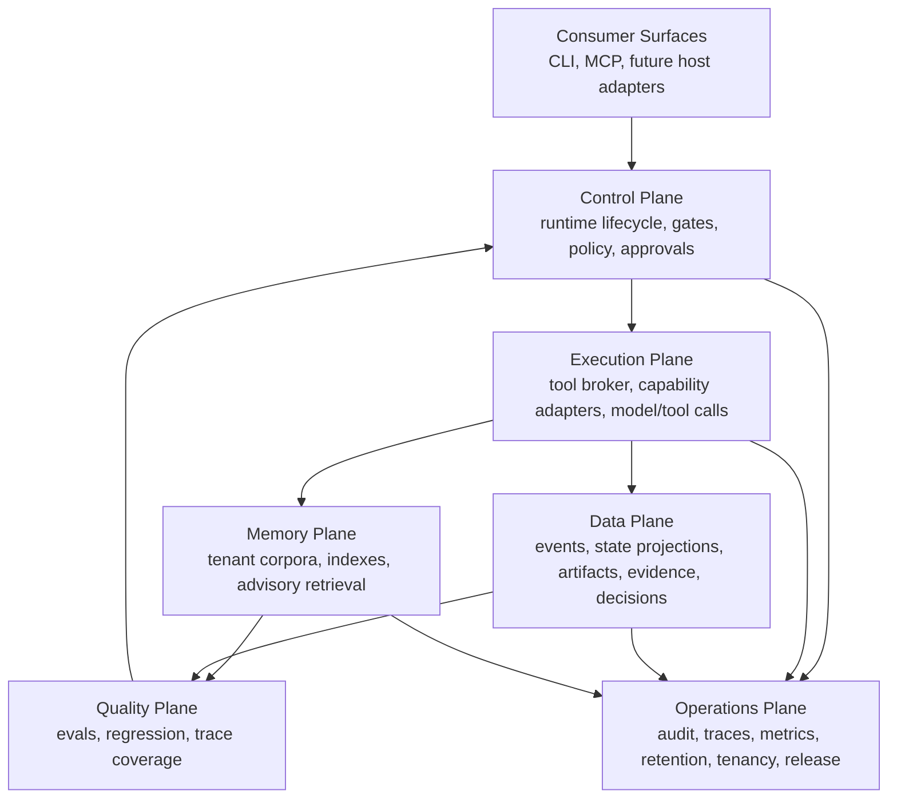
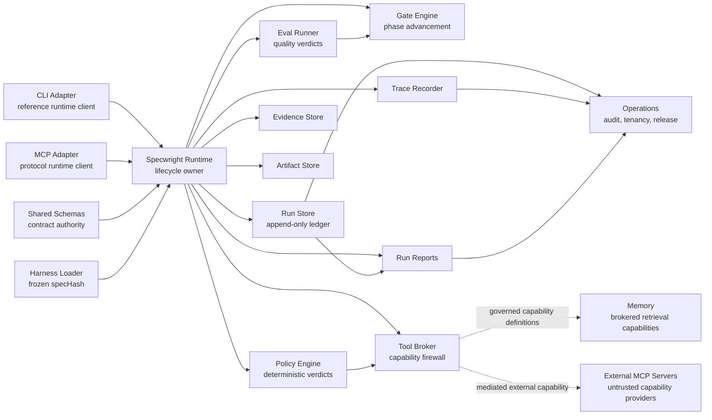
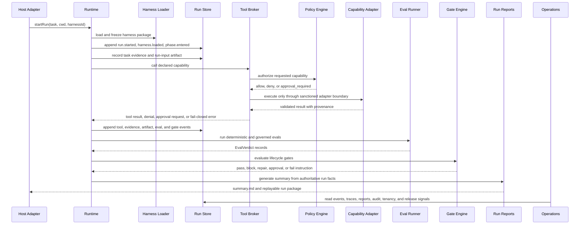

# Specwright

<p align="center">
  
</p>

**Specwright is a strict, replayable agent harness runtime for governed, source-grounded work.**

It is built for teams that need agentic workflows to behave like production systems: lifecycle-bound, policy-governed, capability-brokered, evidence-grounded, artifact-validated, eval-checked, replayable, auditable, tenant-aware, and portable across host surfaces.

Specwright is not a chatbot, a prompt pack, or a loose collection of tools. It is the runtime law around agent work: host adapters submit intent, the runtime owns behavior, external capability flows through a broker, gates decide lifecycle advancement, policy stays deterministic, memory retrieval remains advisory, and the append-only run log remains the source of truth.

## Why Specwright Exists

Modern coding agents can produce impressive work, but most harnesses still leave critical production questions to convention:

- What exactly did the agent do, in what order, and under which authority?
- Which facts came from source evidence, which were assumptions, and which remain unknown?
- Which tool calls were allowed, denied, approved, cached, redacted, replayed, or quarantined?
- Why did a lifecycle phase advance?
- Which retrieval results were shown to the model, and were they evidence or only advisory context?
- Can the run be reconstructed later without trusting a transcript?

Specwright answers those questions with runtime-owned contracts: append-only events, deterministic policy and gate verdicts, broker-mediated capabilities, evidence-bound artifacts, governed evals, trace spans, audit exports, tenant partitions, compatibility gates, and replayable run packages.

## What This Repository Contains

This repository is the TypeScript/Bun implementation of the Specwright runtime platform. It implements the enterprise scope set: shared contracts, run storage, harness loading, policy, gates, brokered capabilities, evals, CLI and MCP adapters, operational governance, and governed memory/retrieval.

| Package | Responsibility |
| --- | --- |
| `@specwright/schemas` | Zod contracts, generated type surfaces, event unions, artifact/evidence authority, redaction primitives, compatibility helpers, and migration fixtures. |
| `@specwright/run-store` | File-first append-only run ledger, state projection, replay, integrity, retention, sealing, archival, and migration paths. |
| `@specwright/harness-loader` | Declarative harness loading, validation, registry lifecycle, trust checks, compatibility, and immutable `specHash` snapshots. |
| `@specwright/policy-engine` | Deterministic `allow`, `deny`, and `approval_required` verdicts with decision hashes, replay fixtures, mutation coverage, and governance validation. |
| `@specwright/gate-engine` | Lifecycle gate evaluation, versioned gate definitions, deterministic verdict hashes, model-assisted advisory checks, repair instructions, and golden fixture governance. |
| `@specwright/tool-broker` | The capability boundary for validation, authorization, approval coordination, limits, redaction, provenance, cache semantics, isolation tiers, and replay. The default sanctioned in-process registry executes `fs.list` and `fs.read`; higher-tier capability definitions fail closed until a sanctioned runner is attached. |
| `@specwright/eval-runner` | Governed eval execution with registry resolution, deterministic verdict hashes, constrained model-assisted grading, pinned datasets, regression checks, event/span emission, and fail-closed conformance fixtures. |
| `@specwright/evidence-store` | Evidence recording for source facts, assumptions, human decisions, external observations, and unresolved unknowns. |
| `@specwright/artifact-store` | Schema-valid artifact recording with claim-level evidence binding and durable artifact references. |
| `@specwright/trace-recorder` | Runtime-observable trace spans for phases, tools, gates, evals, approvals, and cache decisions. |
| `@specwright/run-reports` | Human-readable run reports and audit-oriented summaries generated from authoritative run facts. |
| `@specwright/operations` | Enterprise operations contracts for audit records, tenant partitioning, compatibility classification, release promotion, rollback, and replay readiness. |
| `@specwright/memory` | Governed harness memory: corpus ingestion, chunking, BM25, proximity, dense retrieval, vector indexing, fusion, rerank, MMR diversification, retrieval evals, redaction, tombstones, and broker capability definitions for `memory.*` and `embeddings.*`. |
| `@specwright/runtime` | The orchestration facade that wires stores, loader, policy, gates, brokered tools, evals, traces, artifacts, evidence, and reports. |
| `@specwright/adapters-cli` | Reference CLI adapter with stable output contracts, exit-code semantics, CI posture, redaction profiles, telemetry, and fail-closed command handling. |
| `@specwright/adapters-mcp` | MCP protocol adapter exposing runtime-backed tools, read-only resources, runtime-action prompts, auth composition, egress redaction, observability, audit export, external MCP mediation, limits, versioning, and conformance coverage. |
| `@specwright/adapter-parity` | Adapter parity conformance checks proving host surfaces preserve runtime semantics. |
| `harnesses/default` | Default source-bound harness package: phases, gates, policies, tools, artifact schemas, and eval definitions used by the proof path. |

## Architecture

### Product Planes



### Runtime Dependency Shape



### Run Lifecycle



## Current Proof Path

The default proof run demonstrates the strict source-bound path end to end:

1. Start a run with the default declarative harness.
2. Record the user task as evidence and the run input as a schema-valid artifact.
3. Read source files only through `ToolBroker` capabilities.
4. Record source-bound evidence and artifacts.
5. Evaluate lifecycle gates for intake, evidence, planning, verification, and packaging.
6. Run governed evals for artifact schema presence, completeness, source fidelity, and conformance boundaries.
7. Write `summary.md`.
8. Replay the run from `events.jsonl` and verify the projection.

The broader package suites cover the enterprise surfaces beyond `proof`: schema contract generation, run-store migration and retention, harness trust and registry lifecycle, policy validation, gate fixture governance, broker conformance and replay, eval fail-closed behavior, CLI output contracts, MCP conformance/versioning/auth/limits/audit, operations tenancy and release checks, and memory chunking/retrieval/eval/broker-policy behavior.

Current boundaries are explicit. The default runtime registry executes only the sanctioned local filesystem capabilities. Memory, embeddings, shell, browser, network, model, and external MCP capabilities are represented as governed capability kinds and definitions, but unsupported isolation tiers fail closed unless a sanctioned runner is supplied. Retrieval is advisory context, not source authority. Broad model generation and git mutation are not ambient runtime powers.

## Install

Specwright uses Bun workspaces.

```bash
git clone https://github.com/NikolaCehic/Specwright.git
cd Specwright
bun install
```

Build all packages in dependency order:

```bash
bun run build
```

Run the test suite:

```bash
bun test
```

Run TypeScript checks:

```bash
bun run typecheck
```

Run the default proof:

```bash
bun run proof
```

## Eval Runner

`packages/eval-runner` owns governed eval execution. It resolves eval definitions from registry manifests, produces schema-valid verdicts with deterministic decision hashes, fails closed for malformed or unsupported inputs, routes model-assisted grading through explicit broker ports, binds regression checks to pinned dataset content, and records eval verdict and repair provenance as runtime events and trace spans.

Run the eval-runner conformance suite directly:

```bash
bun run --cwd packages/eval-runner test
bun run --cwd packages/eval-runner typecheck
```

Other focused gates:

```bash
bun run --cwd packages/policy-engine validate:policy
bun run --cwd packages/tool-broker conformance:broker
bun run --cwd packages/adapters-mcp test
bun run --cwd packages/operations test
bun run --cwd packages/memory test
```

## Use The Reference CLI

After building, run the local CLI entry point directly:

```bash
bun packages/adapters-cli/dist/bin.js help
```

Start a source-bound run against the included fixture:

```bash
bun packages/adapters-cli/dist/bin.js run \
  --cwd fixtures/simple-app \
  --task "Create a source-bound frontend contract" \
  --json
```

The command returns a `runId` and writes a run package under the target workspace. Use that `runId` to inspect, replay, and report:

```bash
bun packages/adapters-cli/dist/bin.js status <run-id> --root fixtures/simple-app
bun packages/adapters-cli/dist/bin.js events <run-id> --root fixtures/simple-app
bun packages/adapters-cli/dist/bin.js replay <run-id> --root fixtures/simple-app
bun packages/adapters-cli/dist/bin.js report <run-id> --root fixtures/simple-app
```

CLI commands support `--json`, `--ci`, and `--deadline <ms>`. Read commands enforce bounded output and redaction profiles. `answer` records a clarification answer through runtime evidence. `approve` and `reject` are contract-reserved and fail closed until the runtime exports an approval-decision API.

The intended installed command name is `specwright`; the direct `bun packages/adapters-cli/dist/bin.js` form is the simplest local workspace path today.

## Use The MCP Adapter

The MCP adapter exposes the runtime as MCP tools, resources, and prompts without becoming a second runtime.

```ts
import { createRuntime } from "@specwright/runtime";
import { createMcpAdapter } from "@specwright/adapters-mcp";

const runtime = createRuntime();
const mcp = createMcpAdapter(runtime, {
  auth: {
    mode: "disabled"
  }
});

const tools = await mcp.dispatch({
  method: "tools/list"
});

const started = await mcp.dispatch({
  method: "tools/call",
  params: {
    name: "specwright_start_run",
    arguments: {
      task: "Create a source-bound frontend contract",
      cwd: "fixtures/simple-app",
      harnessId: "default",
      host: {
        kind: "mcp"
      }
    }
  }
});
```

Enabled MCP tools map one-to-one to runtime operations: `specwright_start_run`, `specwright_get_run`, `specwright_get_events`, `specwright_replay`, `specwright_call_tool`, `specwright_run_eval`, `specwright_record_evidence`, `specwright_record_artifact`, `specwright_evaluate_gate`, `specwright_generate_report`, and `specwright_write_report`.

Read-only resources use `specwright://` URIs for run state, events, artifacts, evidence, evals, trace, reports, and harness specs. Prompts produce runtime action descriptors; they do not execute hidden shortcuts. External MCP servers can be mediated only as brokered, allowlisted, version-pinned, non-authoritative capability providers.

## Use The Runtime API

The runtime facade is the integration surface for adapters and automation:

```ts
import { createRuntime } from "@specwright/runtime";

const runtime = createRuntime();

const handle = await runtime.startRun({
  task: "Create a source-bound frontend contract",
  cwd: "fixtures/simple-app",
  harnessId: "default",
  host: {
    kind: "cli"
  }
});

await runtime.callTool(handle.runId, {
  toolId: "fs.list",
  args: {
    path: "src"
  },
  reason: "Discover the source surface before planning.",
  idempotencyKey: `${handle.runId}:fs.list:src`,
  requestedBy: {
    phase: "source_discovery"
  }
});

await runtime.runEval(handle.runId, "source_fidelity");
await runtime.evaluateGate(handle.runId, "verification.required_evals");
await runtime.writeRunReport(handle.runId);
```

Adapters should call the runtime facade and render its responses. They should not own lifecycle, policy, gate, tool, artifact, evidence, eval, or report behavior.

## Use Memory And Retrieval

`@specwright/memory` implements the governed memory surface used by Scope 11. It provides corpus ingestion, fixed/structural/semantic chunking, lexical BM25, proximity scoring, deterministic dense retrieval, vector index integrity checks, fusion, rerank, MMR diversification, retrieval-quality evals, groundedness graders, redaction, tombstones, and capability definitions for:

- `memory.ingest`
- `memory.search`
- `embeddings.search`
- `memory.get`
- `memory.forget`

These capabilities are designed to enter the runtime through `ToolBroker` with tenant-scoped policy, provenance, redaction, cache eligibility, and replay semantics. In the current in-repo broker, memory and embeddings are tier-1 definitions and fail closed without a sanctioned tier-1 adapter runner. The package tests exercise the memory runtime directly and verify the broker policy, redaction, tenant, cache, and fail-closed boundaries.

## What Specwright Should Be Used For

Specwright is designed for teams building agent workflows where correctness, auditability, source grounding, replay, tenant isolation, and capability governance matter as much as task completion.

It is a good fit for source-bound planning, governed artifact generation, eval-gated automation, adapter parity, MCP-facing runtime control, auditable agent runs, retrieval quality work, and enterprise rollout checks. It is not meant to be an ambient autonomous worker or an unrestricted tool executor.
